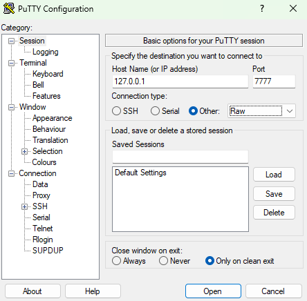
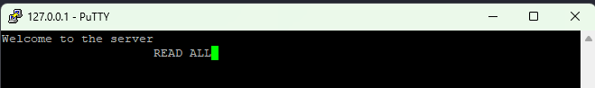

# Requierments for V3

## Español - Windows

Para probar este ejercicio es necesario descargar e instalar el [PuTTY](https://putty.org/).

Seguimos reutilizando el codigo de las API, tanto para la clase 4 como 5, y ahora decidimos darle una cara distinta. Utilizamos `Express` para establecer un servidor web en el puerto `7777` . Sigue recimiendo las consultas `HTTP` pero ahora por medio del PuTTY.

Una vez instalado deberemos configurarlo, aggregando en donde dice:

```
Host name: 127.0.0.1	Port: 7777	Connection Type: Raw
```



Recibe peticiones `HTTP` igual que antes, unicamente que para enviarlas deverá ser por medio de la terminal que se nos abrirá:

La terminal del servidor, está espejada con la del cliente `PuTTY`.



Para probar el funcionamiento de la API recomendamos los siguientes datos:

```
CREATE Pepe Lorenzo 22      : CREATE
CREATE Pepe Lorenzo 22      : ERROR
CREATE Pepe Lorenzo         : ERROR 

READ ALL                    : READ
READ                        : ERROR
READ Juan                   : READ

UPDATE Pepe Popo Lorento 23 : UPDATE
UPDATE Papa Popo Lorento 23 : ERROR
UPDATE                      : ERROR

DELETE ALL                  : DELETE
DELETE                      : ERROR
DELETE Popo Lorento 23      : DELETE
DELETE Papa Popo Lorento 23 : ERROR
DELETE Popo Lorento 23      : ERROR

PUT Pepe Popo Lorento 23    : ERROR 
```

## English - Windows

To perform this exercise it is necessary to download and install [PuTTY](https://putty.org/).

We continue to reuse the API code, both for class 4 and 5, and now we decided to give it a different face. We use `Express` to establish a web server on port `7777`. You still receive `HTTP` queries, but now through PuTTY.

Once installed we must configure it, adding where it says:

```
Host name: 127.0.0.1	Port: 7777	Connection Type: Raw
```


Receive `HTTP` requests the same as before, only to send them it must be through the terminal that will open:

The server terminal is mirrored with that of the `PuTTY` host.


To test the operation of the API we recommend the following data:

```
CREATE Pepe Lorenzo 22      : CREATE
CREATE Pepe Lorenzo 22      : ERROR
CREATE Pepe Lorenzo         : ERROR 

READ ALL                    : READ
READ                        : ERROR
READ Juan                   : READ

UPDATE Pepe Popo Lorento 23 : UPDATE
UPDATE Papa Popo Lorento 23 : ERROR
UPDATE                      : ERROR

DELETE ALL                  : DELETE
DELETE                      : ERROR
DELETE Popo Lorento 23      : DELETE
DELETE Papa Popo Lorento 23 : ERROR
DELETE Popo Lorento 23      : ERROR

PUT Pepe Popo Lorento 23    : ERROR 
```
